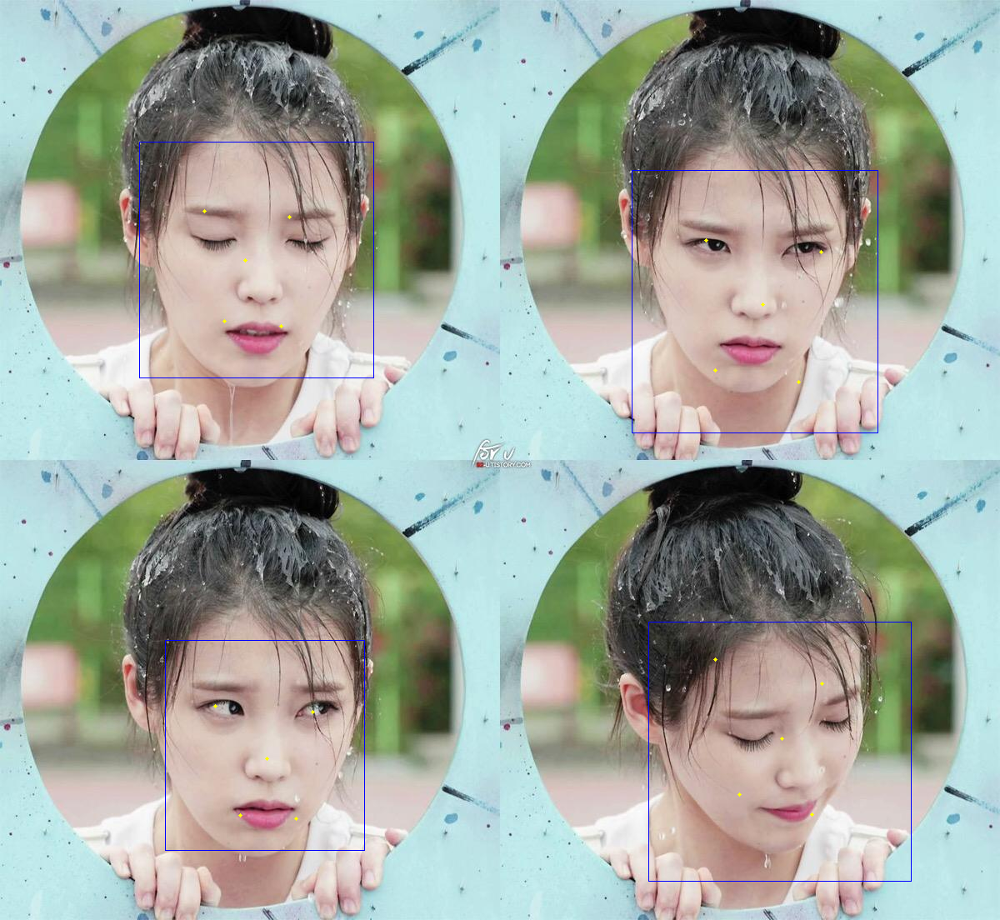

# MTCNN-TensorFlow-2

## 简介

人脸检测完整复现，Python3.7+Tensorflow2
从模型的搭建到数据集的加载预处理，模型的训练，完整的实现了人脸框检测和5个关键点的标注


## 食用方法

+ 安装环境，python3.3以上应该都可以，tensorflow2必装，可以装gpu版；建议python3.7 + tensorflow2-gpu + win10

```cmd
pip install tensorflow-gpu
pip install opencv-python
pip install tqdm
```

+ 使用

`python -m mtcnn.detect [图片路径]`   可以包含多张图片，循环检测，输出并显示检测结果

`python camera_demo.py` 调用摄像头检测人脸

+ 目录结构

----------------------------------------------

正文结束

----------------------------------------------

## 总结

这个项目之前写过一个，当时为了完成课程设计，只实现了部分内容，代码也比较乱，这次算是对之前工作的整理，并完善了MTCNN的全部内容，包括数据集的预处理，训练数据的生成，人脸框检测和关键点标注。

### 训练数据

训练集在这里，[WIDERFace](http://mmlab.ie.cuhk.edu.hk/projects/WIDERFace/)和[Cascade](http://mmlab.ie.cuhk.edu.hk/archive/CNN_FacePoint.htm),看需求如果不作关键点检测第一个数据集就够了，第二个数据集单张图片只标注了一个人脸和5个关键点位置，所以不适合来作人脸框的检测。MTCNN三个网络所需的训练数据类似，所以之前的工作我是只用了第1个数据集随机裁剪了3种大小(12, 24, 48)的数据训练，最后结果其实也可以，反正足够课程设计的考核。论文中当然不提倡这种做法了，它分三次产生了每个网络所需的训练数据，据说可以提高网络的精度，但是需要的时间剧增。具体是这么做的：

+ 第一个网络PNet的输入为12*12*3，从WiderFace数据集中随机截取产生3种不同类型的数据pos：part：neg=1：1：3，不同类型的数据通过iou划分，这个基本都有介绍。[pre_crop](prepare_data/pre_crop_img.py)这个文件有详细的代码实现。还有1个类型的数据mark通过Cascade数据集产生，注意它应该也是pos类型的数据只不过它多了关键点的标注，所以归为第4类，它和pos占比相同。

+ 各个类型的数据知道怎么产生了，那怎么组合它们成1:1:3:1呢，参考了众多代码这一过程看起来都不美观，包括我之前写的代码，这次利用tf.data整合了一下，通过保存4种类型的tfrecord文件，再以不同的比例组合，具体实现可以参考[tf_data](prepare_data/tf_data.py)中的Dataset类，里边集成了所有网络需要的数据类型，再也不像之前分成众多不同的文件处理不同网络的训练数据了。

+ PNet训练完成后，这个网络就可以初步判断一张图片中人脸的位置了，于是乎RNet网络的训练数据就可以通过PNet做一个筛选了。首先PNet是一个全卷积网络，输入一张完整的图片，输出的是图片上一定间隔的人脸概率和框的偏移，关键点标记的输出前两个网络都不用管。RNet的训练数据不像PNet一样直接对整张图片作随机截取了，论文中叫hard样本，通过PNet输出每张图片的人脸框再结合真实人脸框计算iou，得到和PNet类似的3种数据，mark类型的数据这里有一个问题，由于cascade数据集中只标注了1个人脸，对于有多个人脸的数据计算iou的时候就会出现问题。所以这里偷了一个懒，直接生成48*48*3类型的mark数据，不同的网络再resize调整成对应的尺寸，这一点代码中也有体现。ONet网络的训练数据同理，这个文件[tf_data](prepare_data/tf_data.py)提供了一个非常卧槽的写法，建议反复观看 :smile:

### 网络结构

这一部分大同小异，tensorflow.keras搭这种网络简直不要太简单，论文中人脸的分类用的softmax输出2个长度的向量，其实这里用sigmoid输出1个长度的不香吗，仔细一想这里边应该是更接近概率的输出吧。参考[model](mtcnn/model.py)文件。

### 训练过程

首先要明确为什么要分成这三个网络，每一个网络都有啥用。每一个网络的训练用对应的训练数据跑就完事了，然后是注意一下每个网络3个输出分量的训练权重，参考[train](mtcnn/train.py)。同时，参考[model](mtcnn/model.py)中定义的损失函数，输入的4个类型的数据分别有对应的训练目标。例如：

+ pos和neg用于训练概率的交叉熵损失，我这里其实也加入了mark数据，由mark数据的产生方式可以它也属于pos数据；

+ pos、mark和part数据用于训练框回归损失

+ mark用于训练关键点回归损失

### 预测阶段

前面都是铺垫，真正检测人脸的还是[detect](mtcnn/detect.py)。这一部分也分为3个阶段，对应3个网络。

+ PNet全卷积网络，输入一张图片，输出3个部分，cls、reg、mark，其中mark只在训练阶段起作用，cls输出为整个图片人脸概率图，每一个像素代表原图12*12大小的区域人脸概率，从中可以发现如果直接以原图作为输入，那它只能检测12*12大小的人脸，所以需要对原图进行一个金字塔缩放以适应不同大小的人脸，选定一个最小人脸尺寸，将最小人脸缩放至12*12，而后以根2的比例逐渐将原图缩放至12*12

+ 通过PNet的输出可以尽可能获得人脸数量和粗略的人脸框定位，这里通过调整概率阈值可以获得不同数量的人脸，需要一个权衡，阈值越小，输出的人脸越多，越不可能漏检测，但是RNet检测时间就越长，代码中给出了默认值。根据PNet输出从原图裁剪对应的图像数据作为RNet的输入，同时注意边缘的处理，代码里也有体现。

+ RNet的输出其实就可以满足部分需求了，最后再以同样的处理方式获得ONet的输入数据，最后输出人脸框、关键点坐标。

+ 通过调节net=[1,2,3]的值可以获得不同网络的输出，这也便于生成困难样本。

### 题外话

哪里最麻烦？肯定是写这个文档最难啦，以至于我拖了好久，其实代码早就写好了，也训练完了，就是迟迟不想写这个总结。今天算是写完了部分吧，也算是复习了一遍代码，希望能对以后的自己有所帮助。。。完结撒花！！！ 啊
